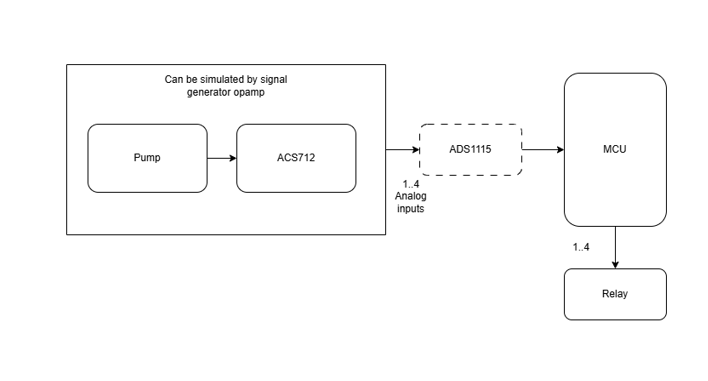

# Experiment Design Document — Current Sensor / Pump Monitor / Relay Profiling

**Branch:** `rilwan-saliu-current-sensor-pump-monitor-experiment`
**Firmware:** `main/experiment.hpp` / `main/experiment.cpp` (selected via `CONFIG_FPC_EXPERIMENT_MODE_ENABLE`, does not alter the production boot path in [main.cpp](../../main/main.cpp))
**Components under test:** [current_sensor](../../components/current_sensor), [pump_monitor](../../components/pump_monitor), [relay_driver](../../components/relay_driver), [pump_control_unit](../../components/pump_control_unit), [pump_monitor_task](../../components/pump_monitor_task)

## 1. Goal

Characterize the timing and accuracy envelope of the current-sensing → pump-monitor analytics → relay-trip pipeline so that system-level requirements (max pumps supported, sampling period, overcurrent response time) can be set with evidence rather than assumption.

## 2. Test Rig

| Item | Detail |
|---|---|
| Target | ESP32-S3 (per `sdkconfig`), same board as production |
| Current sensor front-end | ACS712 via `InternalAdcAcs712Config` (internal ADC, `ADC_UNIT_1`) **and** `Ads1115Acs712Config` (I2C, `I2C_NUM_1`, SDA=GPIO6, SCL=GPIO7, addr=0x48) — both are profiled independently (see `board::kAds1115*` in [hardware_pins.hpp](../../components/common/include/hardware_pins.hpp)) |
| Relay | GPIO output per `RelayConfig` (production default pin 4 in the sample config JSON in [main.cpp](../../main/main.cpp)); coil switching time to be captured with a scope/logic analyzer probing the GPIO pin directly if available |
| Reference instrument | Bench multimeter or calibrated shunt/current-clamp, and if possible a programmable DC electronic load / current source for repeatable step changes |
| Clock source | `esp_timer_get_time()` (microsecond resolution, monotonic) for all latency measurements; FreeRTOS ticks only for task-period bookkeeping |
| Logging | `ESP_LOGI`/`ESP_LOGW` CSV-style lines over UART (115200 baud, ESP-IDF Monitor), tag `EXP`, parseable offline (e.g., `EXP1,i,latency_us`) |

### FreeRTOS / sdkconfig parameters used

- `PumpMonitorTaskConfig::stack_size` = 4096 B, `priority` = 5 (component defaults), overridable per experiment.
- `CONFIG_FPC_EXPERIMENT_CHECK_INTERVAL_MS` governs the polling period for experiments 3 and 7.
- I2C `scl_speed_hz` = 100 kHz (default in `Ads1115Acs712Config`); ADC attenuation `ADC_ATTEN_DB_12`, default bitwidth.
- No changes to `sdkconfig` are required beyond what is already committed; experiment mode is a pure application-layer switch.

### Known confounds

- I2C bus speed (100 kHz) sets a hard floor on ADS1115 read latency (~1 ms/conversion at default data rate) — must not be conflated with ADC-path latency.
- ADC oversampling / calibration scheme (`ADC_CALI_SCHEME_CURVE_FITTING` vs `LINE_FITTING`) affects both latency and accuracy; log which scheme was compiled in.
- FreeRTOS scheduling jitter and log output (`ESP_LOGI` itself blocks on UART) can perturb timing — long CSV traces are buffered rather than logged synchronously where feasible, and logging under test is minimized in the hot loop of experiments 1 and 3.
- Relay coil physical actuation time (mechanical relays) vs. GPIO edge time (solid-state) — only the GPIO-edge-to-firmware-timestamp interval is measured by firmware; physical trip time must be corroborated with a scope for mechanical relays.
- Ambient temperature drift affects ACS712 zero-point (`zero_voltage_mv`) — accuracy experiment (#2) should log rig temperature if a sensor is available, otherwise note ambient conditions manually.

## 3. Metrics, Method, and Acceptance Criteria

### 3.1 Current-read latency (Experiment 1)

- **API under test:** `ICurrentSensor::read()` (both `InternalAdcAcs712Config` and `Ads1115Acs712Config` backends), or `SYNTHETIC` backend as a firmware-overhead-only baseline.
- **Method:** Bracket each `read()` call with `esp_timer_get_time()` before/after, N = `CONFIG_FPC_EXPERIMENT_SAMPLE_COUNT` (default 1000) consecutive calls, no inter-call delay.
- **Output:** min/mean/max/p99 latency (µs) per backend, computed on-device and logged as a summary line, plus raw CSV for offline percentile recomputation.
- **Target / acceptance:** Internal ADC path < 200 µs mean; ADS1115 (I2C) path < 2 ms mean (bounded by 100 kHz bus + conversion time). Document actual measured values as the accepted baseline — this experiment is exploratory, not pass/fail, unless a prior spec exists.

### 3.2 Current-read accuracy (Experiment 2)

- **API under test:** `ICurrentSensor::read()` compared against a reference meter.
- **Method:** Operator-paced sweep. At each step (0 A, then increments up to rated current), the firmware prompts (log message) and waits `CONFIG_FPC_EXPERIMENT_STEP_DELAY_MS`, then logs N samples (default 50) with mean/stddev. Operator records the reference-meter value out-of-band and computes error offline (Amps and %FS).
- **Output:** CSV `EXP2,step_amps_nominal,sample_mean,sample_stddev`.
- **Target / acceptance:** Error ≤ manufacturer datasheet tolerance for ACS712 (typically ±1.5% FS) plus ADC/ADS1115 quantization; zero-offset drift measured at 0 A across the run should stay within one LSB-equivalent current step.

### 3.3 Consecutive-read throughput (Experiment 3)

- **API under test:** `PumpMonitor::check_current()` end-to-end (i.e., `number_of_samples` back-to-back `read()` calls + analytics), via `PumpMonitorConfig::number_of_samples` swept across 1, 5, 10, 20, 50 (`kMaxSamples`).
- **Method:** For each `number_of_samples` value, call `check_current()` repeatedly for a fixed duration or count, timestamp each call, compute achieved Hz = 1 / mean(call duration).
- **Output:** CSV `EXP3,number_of_samples,mean_duration_us,achieved_hz`.
- **Target / acceptance:** Throughput should scale ~linearly (inversely) with `number_of_samples`; document any non-linearity (e.g., fixed analytics overhead) as it directly bounds `PumpMonitorTaskConfig::check_interval_ms` feasibility.

### 3.4 Overcurrent detection tolerance (Experiment 4)

- **APIs under test:** `current_analytics_basic_decision` / `current_analytics_capacity_decision`, driven through `PumpMonitor::check_current()` with a synthetic `ReadCallback` that ramps current in small steps (default 1% of `current_rating`) above `PumpConfig::current_rating`.
- **Method:** At each step, hold the synthetic current constant for `number_of_samples` calls, invoke `check_current()`, and log the resulting `PumpStateMachineState` (observed indirectly via the subscriber `PumpMonitorEventCallback`). Repeat both increasing (rating → above) and decreasing (above → rating) sweeps to detect analytics hysteresis.
- **Output:** CSV `EXP4,step_pct_above_rating,injected_amps,resulting_event`.
- **Target / acceptance:** Report the smallest `step_pct_above_rating` at which `EventType::PumpOvercurrent` is reliably raised (100% of repeated trials at that step); report false-positive rate below rating and false-negative rate above rating, if any.

### 3.5 State-change reaction latency (Experiment 5)

- **API under test:** `PumpMonitor::subscribe()` callback firing latency relative to the underlying current step.
- **Method:** Synthetic `ReadCallback` returns nominal current for the first K calls, then flips to an overcurrent value. The flip is timestamped (`t0 = esp_timer_get_time()`) at the exact call boundary. The subscriber callback records `t1` on first invocation carrying `EventType::PumpOvercurrent`. Reaction latency = `t1 - t0`. Repeated ≥ 30 times for statistics.
- **Output:** CSV `EXP5,trial,latency_us`.
- **Target / acceptance:** Latency should be bounded by `PumpMonitorTaskConfig::check_interval_ms` (task-driven) or by direct call latency (synchronous-call mode); report both min/mean/max and compare to the configured interval to quantify scheduling overhead.

### 3.6 Relay trip latency (Experiment 6)

- **API under test:** `IRelay::trip()` invoked from inside a `PumpMonitorEventCallback` subscriber wired to `EventType::PumpOvercurrent`.
- **Method:** Reuses the Experiment 5 synthetic step generator. `t0` = step injection time; `t1` = timestamp captured immediately before `relay.trip()` call inside the subscriber; `t2` = timestamp captured immediately after `trip()` returns. Report `t1 - t0` (detection latency, same as Exp. 5) and `t2 - t1` (relay-driver call latency). If a scope/logic analyzer is available, additionally capture the real GPIO falling/steady-state edge time and compare to `t2`.
- **Output:** CSV `EXP6,trial,detect_latency_us,relay_call_latency_us`.
- **Target / acceptance:** `relay_call_latency_us` should be small and consistent (GPIO register write); flag outliers (possible scheduler preemption).

### 3.7 Multi-pump scaling behavior (Experiment 7 — "max pumps" mode)

- **APIs under test:** `PumpControlUnit` (up to `kMaxMonitors` = 10) with one `PumpMonitorTask` per `PumpMonitor`, each driven by an independent synthetic `ReadCallback`.
- **Method:** Instantiate 1, 2, 5, and `kMaxMonitors` `PumpMonitor`/`PumpMonitorTask` pairs (configurable via `CONFIG_FPC_EXPERIMENT_PUMP_COUNT`), each with `check_interval_ms` = `CONFIG_FPC_EXPERIMENT_CHECK_INTERVAL_MS`. Each synthetic `ReadCallback` timestamps its own invocation and logs the delta from its previous invocation (jitter around the configured interval). Additionally, one monitor is driven into overcurrent partway through the run to re-measure Experiment 5/6 reaction latency under load.
- **Output:** CSV `EXP7,pump_id,call_index,interval_delta_us` plus a repeat of the `EXP5`/`EXP6` lines for the reaction-latency-under-load sub-test.
- **Target / acceptance:** Interval jitter (stddev of `interval_delta_us`) should stay within an agreed bound (e.g., < 10% of `check_interval_ms`) up to `kMaxMonitors`; reaction latency under max load should be compared against the single-pump baseline from Experiments 5/6 to quantify degradation.

## 4. Firmware Configuration Reference

All experiments are compiled into the standard production binary but only activated when `CONFIG_FPC_EXPERIMENT_MODE_ENABLE=y` (Kconfig, see [Kconfig.projbuild](../../main/Kconfig.projbuild)). Relevant options:

| Kconfig symbol | Purpose | Default |
|---|---|---|
| `FPC_EXPERIMENT_MODE_ENABLE` | Master switch; when `y`, `app_main()` runs `fpc::experiment::run()` instead of the normal `DeviceMode` flow | `n` |
| `FPC_EXPERIMENT_ID` | Which experiment (1–7) to run | `1` |
| `FPC_EXPERIMENT_SENSOR_BACKEND` | `INTERNAL_ADC` / `ADS1115` / `SYNTHETIC` | `SYNTHETIC` |
| `FPC_EXPERIMENT_SAMPLE_COUNT` | N for latency/throughput loops | `1000` |
| `FPC_EXPERIMENT_STEP_DELAY_MS` | Settling delay between accuracy-sweep steps | `3000` |
| `FPC_EXPERIMENT_CHECK_INTERVAL_MS` | Poll period for Experiments 3 & 7 | `100` |
| `FPC_EXPERIMENT_PUMP_COUNT` | Number of pump monitors for Experiment 7 | `10` |
| `FPC_EXPERIMENT_DURATION_S` | Run duration for task-driven experiments (5/6/7) | `30` |

`SYNTHETIC` is the default backend so the experiment firmware builds and runs meaningfully without any current-sensor hardware attached (useful for CI / dry-run validation of the harness itself); switch to `INTERNAL_ADC` or `ADS1115` for real hardware profiling of Experiments 1–2.

## 5. Data Analysis

All raw CSV lines are captured from the serial monitor log (`idf.py monitor` / ESP-IDF Monitor terminal) and post-processed offline (e.g., Python/pandas) to compute percentiles, stddev, and plots. This document does not prescribe the offline tooling; any script consuming the `EXP<N>,...` CSV format is acceptable.

## 6. Out of Scope / Deferred

- Long-duration (multi-day) drift/aging characterization of the current sensor.
- Thermal chamber testing.
- Automated pass/fail gating in CI (this is a manual bench-profiling exercise).

## 7. Hardware Setup

